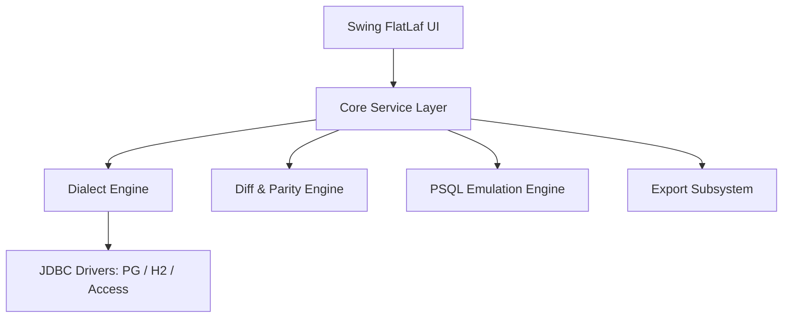

# SchemaSync Architecture

## Layer Responsibilities
- `com.dbtool.core.dialect`: Abstracts dialect variations (quoting, catalogs, paging).
- `com.dbtool.core.diff`: High performance schema and row parity comparisons.
- `com.dbtool.core.script`: Lexical parsing and execution of SQL scripts with meta-commands.
